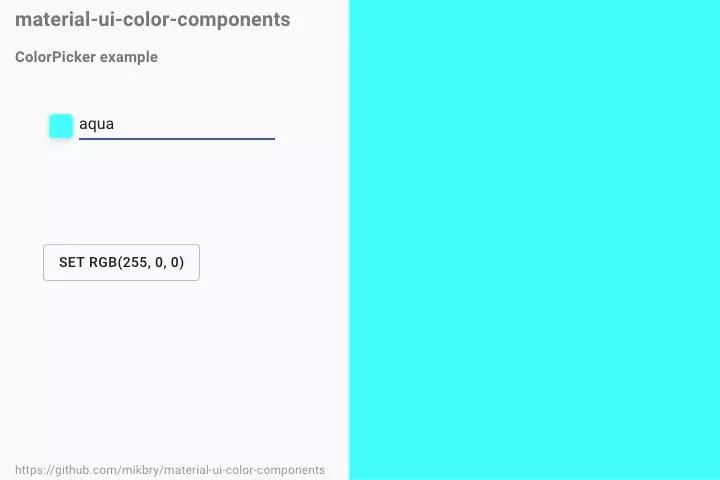

# `material-ui-color` picker and other components

[![Build Status][action-image]][action-url]
[![codecov][codecov-image]][codecov-url]
[![NPM version][npm-image]][npm-url]
[![License][license-image]][license-url]
[![minisize][min-image]][min-url]

[action-image]: https://github.com/mikbry/material-ui-color/workflows/Build%20and%20Deploy/badge.svg
[action-url]: https://mikbry.github.io/material-ui-color/
[codecov-image]: https://codecov.io/gh/mikbry/material-ui-color/branch/master/graph/badge.svg?token=K4P0vnM5fh
[codecov-url]: https://codecov.io/gh/mikbry/material-ui-color
[npm-image]: https://img.shields.io/npm/v/material-ui-color.svg
[npm-url]: https://npmjs.org/package/material-ui-color
[license-image]: https://img.shields.io/github/license/mikbry/material-ui-color
[License-url]:https://github.com/mikbry/material-ui-color/blob/master/LICENSE
[min-image]:https://badgen.net/bundlephobia/min/material-ui-color
[min-url]:https://bundlephobia.com/result?p=material-ui-color

> Collections of color components for `material-ui`. No dependencies, small, highly customizable and theming support !



## Contents

- [Why another ColorPicker?](#why-another-colorpicker)
- [Documentation](#documentation)
- [Requirements](#requirements)
- [Install](#install)
- [Usage](#usage)
- [Roadmap](#roadmap)
- [Contribute](#contribute)
- [License](#license)

## Why another ColorPicker ?

- Fully compatible with Material-UI : theming and low level components
- Styled with `styled-components`
- Highly customizable ColorPicker : gradient picker, palette, input format, deferred mode
-  Small in size (<30kb) without any extra dependencies
- Use modern React hook and coding conventions
- Documentation made with Storybook, using Component Story Format and MDX

## Documentation

Full documentation is available here :

https://mikbry.github.io/material-ui-color/


## Requirements
- Works on modern browsers supporting ES6+ (Not compatible with IE)
- Latest React, Styled-Component and Material-UI frameworks

## Install

```bash
yarn add material-ui-color
```

Or using npm
```bash
npm install material-ui-color
```

## Usage

you need to have in your dependencies:

```
    "@material-ui/core": "^4.9.5",
    "material-ui-popup-state": "^1.5.3",
    "prop-types": "15.7.2",
    "react": "^16.12.0",
    "react-dom": "^16.12.0",
    "styled-components": "^5.0.1"
```

`material-ui-color` bring 5 components.

### `<ColorPicker/>`

A popover component to display a color tool box. It uses `ColorBox` and `material-ui-popup-state`.

```javascript
import { ColorPicker } from 'material-ui-color';

export const Container = () => (
  <div>
    <ColorPicker defaultValue="transparent"/>
  </div>
);
```

At first it display a button + an input

[ColorPicker documentation](https://mikbry.github.io/material-ui-color/?path=/story/components-colorpicker--basic)

### `<ColorBox />`

A component to display a color tool box
```javascript
import { ColorBox } from 'material-ui-color';

export const Container = () => (
  <div>
    <ColorBox defaultValue="transparent"/>
  </div>
);
```

[ColorBox documentation](https://mikbry.github.io/material-ui-color/?path=/story/components-colorbox--basic)

### `<ColorInput />`

An input component to display/edit color values in different format (plain, hex, rgb, hsl, hsv).

```javascript
import { ColorInput } from 'material-ui-color';

export const Container = () => (
  <div>
    <ColorInput defaultValue="red"/>
  </div>
);
```

[ColorInput documentation](https://mikbry.github.io/material-ui-color/?path=/story/components-colorinput--basic)

### `<ColorPalette />`

A component to display a grid of color buckets.

```javascript
import { ColorPalette } from 'material-ui-color';

const palette = {
  red: '#ff0000',
  blue: '#0000ff',
  green: '#00ff00',
  yellow: 'yellow',
  cyan: 'cyan',
  lime: 'lime',
  gray: 'gray',
  orange: 'orange',
  purple: 'purple',
  black: 'black',
  white: 'white',
  pink: 'pink',
  darkblue: 'darkblue',
};

export const Container = () => (
  <div>
    <ColorPalette palette={palette} />
  </div>
);
```

[ColorPalette documentation](https://mikbry.github.io/material-ui-color/?path=/story/components-colorpalette--basic)

### `<ColorButton />`

Displays a button filled with a color

```javascript
import { ColorButton } from 'material-ui-color';

export const Container = () => (
  <div>
    <ColorButton color="red"/>
  </div>
);
```

[ColorButton documentation](https://mikbry.github.io/material-ui-color/?path=/story/components-colorbutton--basic)

## Roadmap

### v0.3.0 - [Current version](https://github.com/mikbry/material-ui-color/projects/1)
- add Typescript support
- accessibility : keyboard and touch support
- localization
- disable alpha property
- #30, #29, #22 resolved
- WIP - better documentation: colorType explained, i18n, typescript examples

### v0.4.0 - WIP
- optimize code
- redesign inputs in ColorBox
- remove `styled-components` to have less dependencies and reduce size
- bugs fixes

### v0.5.0  - planned
- rtl support
- ColorInput : display alpha and size according to  MUi
- ColorInput : optional color box as left or right icon
- ColorPicker: left or right Colorbox
- bugs fixes

## Contribute

Contributions welcome! Read the [contribution guidelines](CONTRIBUTING.md) first.


## License

Released under MIT License
