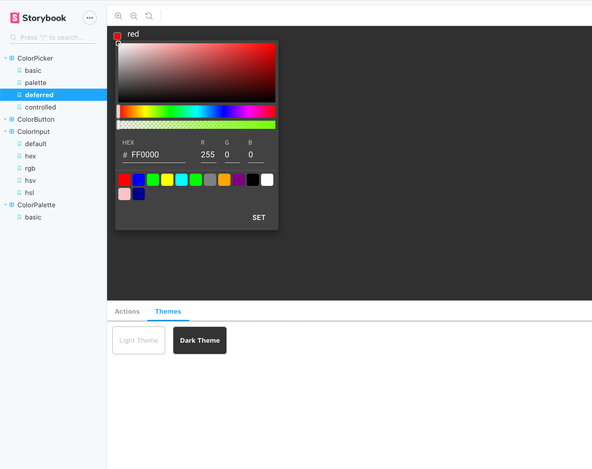

# `material-ui-color-components`
[WIP] Collections of color components for `material-ui` components for React Material-UI. Highly customizable and theming support !

## Why ?

- Fully compatible with Material-UI : Theming and low level components
- Highly customizable ColorPicker : gradient picker, palette, input format, deferred mode
-  Small in size without extra dependencies
- Use modern hooks and coding conventions

## `<ColorPicker/>`

## `<ColorInput />`

## `<ColorPalette />`

## `<ColorButton />`

## WIP
TODO list
- [x] init project
- [x] create simple color picker
- [ ] create color tools/helpers
- [ ] tests / coverages
- [ ] publish
- [ ] documentation
