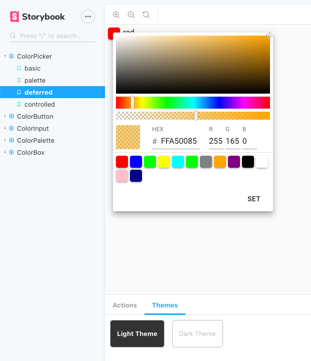

# `material-ui-color-components`

[![Build Status][action-image]][action-url]
[![codecov][codecov-image]][codecov-url]
[![NPM version][npm-image]][npm-url]
[![License][license-image]][license-url]

[action-image]: https://github.com/mikbry/material-ui-color-components/workflows/Build%20and%20Deploy/badge.svg
[action-url]: https://mikbry.github.io/material-ui-color-components/
[codecov-image]: https://codecov.io/gh/mikbry/material-ui-color-components/branch/master/graph/badge.svg?token=K4P0vnM5fh
[codecov-url]: https://codecov.io/gh/mikbry/material-ui-color-components
[npm-image]: https://img.shields.io/npm/v/material-ui-color-components.svg
[npm-url]: https://npmjs.org/package/material-ui-color-components
[license-image]: https://img.shields.io/npm/l/amaterial-ui-color-components.svg
[License-url]:./LICENSE

[WIP] Collections of color components for `material-ui` components for React Material-UI. Highly customizable and theming support !

## Why ?

- Fully compatible with Material-UI : Theming and low level components
- Highly customizable ColorPicker : gradient picker, palette, input format, deferred mode
-  Small in size without extra dependencies
- Use modern hooks and coding conventions

## `<ColorPicker/>`

TODO : doc

## `<ColorBox />`

TODO : doc

## `<ColorInput />`

TODO : doc

## `<ColorPalette />`

TODO : doc

## `<ColorButton />`

TODO : doc

## WIP
TODO list
- [x] init project
- [x] create simple color picker
- [x] create color tools/helpers
- [ ] tests / coverage
- [ ] publish
- [ ] documentation
